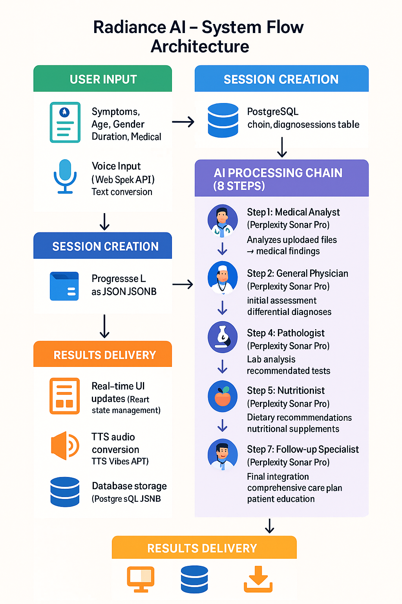

# 🧠 Radiance AI - Intelligent Health Companion

## System Flow Architecture



*Complete end-to-end system flow showing how user input flows through AI processing to deliver comprehensive health assessments*

## Project Overview

Radiance AI is an advanced AI-powered health diagnosis platform that leverages cutting-edge artificial intelligence to provide users with preliminary health assessments. The application uses the Perplexity Sonar API to analyze user-reported symptoms and medical data, offering detailed diagnostic insights, treatment recommendations, and medical guidance.

Designed with a focus on user privacy, data security, and medical accuracy, Radiance AI serves as a preliminary health assessment tool that can help users understand potential health concerns before consulting with healthcare professionals.

## 🌟 Key Features

### 🩺 AI-Powered Diagnosis
- Analyze user-reported symptoms using advanced AI models
- Provide detailed primary diagnosis with ICD codes
- Offer differential diagnoses with likelihood assessments
- Generate evidence-based reasoning with medical citations
- Support for medical image analysis and report interpretation

### 🔄 Multi-Agent Chain Diagnosis System
- Sequential analysis through specialized AI roles:
  - **Medical Analyst** (sonar-deep-research): Analyzes uploaded medical reports and images
  - **General Physician** (sonar-pro): Provides initial diagnosis based on symptoms
  - **Specialist Doctor** (sonar-reasoning-pro): Offers specialized insights
  - **Pathologist** (sonar-pro): Analyzes test results and pathological insights
  - **Nutritionist** (sonar-pro): Recommends dietary changes
  - **Pharmacist** (sonar-pro): Suggests medications and interactions
  - **Follow-up Specialist** (sonar-pro): Recommends follow-up actions
  - **Radiance AI Summarizer** (sonar-pro): Combines all insights into comprehensive care plan
- Each role provides specialized insights for comprehensive healthcare assessment

### 🎙️ Voice Assistant & Speech Features
- **Continuous Voice Recognition**: Real-time speech-to-text with 10-second auto-submission timeout
- **Text-to-Speech (TTS)**: Automatic audio responses using TTS Vibes API
- **Voice Assistant Mode**: Hands-free interaction with automatic listening resumption
- **Speech Integration**: Available in diagnosis forms, standalone chat, and Ask Radiance interfaces
- **Audio Caching**: TTS responses cached in Supabase for improved performance
- **Streaming Audio**: Real-time audio playback as chunks are generated

### 💬 Advanced Chat Interface
- **Standalone Ask Radiance**: Independent chat interface with persistent sessions
- **File Upload Support**: Upload medical reports, images, and documents (PDF, DOCX, images)
- **Chat History**: Persistent conversation history with session management
- **Real-time Responses**: Streaming responses from Perplexity API
- **Message Management**: Clear chat history with automatic TTS cache cleanup
- **Fallback Mode**: Graceful degradation when database tables don't exist

### 📁 File Management System
- **Multi-format Support**: PDF, DOCX, DOC, TXT, JPEG, PNG, GIF files
- **Secure Storage**: Supabase storage with user-specific file organization
- **File Manager**: Organized tabs for All Files, Images, and Documents
- **Upload Progress**: Real-time upload progress with error handling
- **File Metadata**: Comprehensive file information and public URL generation

### 👤 User Profiles & Health Data
- Secure user authentication with Cloudflare Turnstile CAPTCHA
- Comprehensive user profiles with health metrics (BMI calculation)
- Personal health information storage and medical history tracking
- Profile editing with validation and one-time edit restrictions for critical fields
- Country and location data integration

### 📊 Diagnosis History & Analytics
- Complete diagnosis session tracking and history
- Detailed view of past health assessments
- Chain diagnosis progress tracking with step-by-step results
- Export and sharing capabilities for medical records
- Timeline view of health changes over time

### 🌐 Multilingual Support & Accessibility
- Google Translate integration for global accessibility
- Dynamic language selection with country flags
- Real-time page translation capabilities
- Responsive design optimized for all devices
- Professional dark-themed interface with smooth animations

### 📱 Progressive Web App (PWA)
- **Offline Functionality**: Works without internet connection
- **Install Prompt**: Native app-like installation on devices
- **Cross-platform**: Runs on desktop, mobile, and tablet devices
- **Background Sync**: Automatic data synchronization when online
- **Push Notifications**: Health reminders and updates (configurable)

## 🛠️ Technology Stack

### Frontend Technologies
- **Next.js**: React framework with App Router, server-side rendering, and static site generation
- **React**: Latest React version with concurrent features and improved performance
- **TypeScript**: Type-safe JavaScript for robust, maintainable code
- **TailwindCSS**: Utility-first CSS framework with custom design system
- **shadcn/ui**: Modern component library with Radix UI primitives
- **Framer Motion**: Advanced animations and transitions
- **React Hook Form**: Efficient form handling with validation
- **Zod**: Runtime type validation and schema validation

### Backend & Infrastructure
- **Supabase**: Complete Backend-as-a-Service solution
  - **Authentication**: Secure user management with JWT tokens
  - **PostgreSQL Database**: Relational database with real-time subscriptions
  - **Storage**: File storage for medical reports and images
  - **Row Level Security (RLS)**: Data security and user isolation
  - **Real-time**: Live data synchronization across clients

### AI & API Integrations
- **Perplexity Sonar API**: Advanced AI models for medical analysis
  - **sonar-deep-research**: Comprehensive medical analysis and research
  - **sonar-pro**: General medical consultations and specialized roles
  - **sonar-reasoning-pro**: Advanced reasoning for specialist doctor analysis
  - **Image Analysis**: Medical image and report interpretation capabilities
- **TTS Vibes API**: Text-to-speech conversion with multiple voice options
- **Web Speech API**: Browser-native speech recognition and synthesis
- **Google Translate API**: Real-time multilingual support

### Development & Deployment
- **Vercel**: Serverless deployment platform with edge functions
- **Progressive Web App (PWA)**: Native app-like experience across platforms
- **Service Workers**: Offline functionality and background sync
- **Cloudflare Turnstile**: CAPTCHA protection for enhanced security

## 🔧 Core Functionality

### Standard Diagnosis System

The foundational diagnosis system provides quick health assessments:

1. **Data Collection**: Gathers user symptoms, age, gender, duration, and medical history
2. **AI Processing**: Sends data to Perplexity Sonar API with specialized medical prompts
3. **Response Analysis**: Extracts structured medical information:
   - Primary diagnosis with description and ICD-10 codes
   - Differential diagnoses with likelihood percentages
   - Medical reasoning and evidence-based citations
   - Treatment recommendations and protocols
   - Diagnostic test recommendations
   - Lifestyle and dietary advice
4. **User Interface**: Presents information in an accessible, user-friendly format
5. **Data Persistence**: Saves complete diagnosis to user's medical history

### Multi-Agent Chain Diagnosis System

The advanced chain diagnosis system provides comprehensive healthcare assessment through sequential AI specialist consultations:

#### 🔬 **Medical Analyst** (sonar-deep-research)
- Analyzes uploaded medical reports, lab results, and imaging studies
- Extracts key findings and abnormalities from medical documents
- Provides structured data for subsequent specialist consultations
- Supports multiple file formats (PDF, DOCX, images)

#### 👨‍⚕️ **General Physician** (sonar-pro)
- Conducts initial assessment based on symptoms and medical analyst findings
- Provides preliminary diagnosis and differential diagnoses
- Recommends appropriate specialist referrals
- Establishes baseline treatment approach

#### 🩺 **Specialist Doctor** (sonar-reasoning-pro)
- Offers specialized medical insights based on the specific condition
- Provides advanced diagnostic reasoning and treatment protocols
- Recommends specialized tests and procedures
- Delivers expert-level medical guidance

#### 🔬 **Pathologist** (sonar-pro)
- Analyzes laboratory results and pathological findings
- Interprets diagnostic test results and biomarkers
- Provides insights into disease progression and prognosis
- Recommends additional pathological investigations

#### 🥗 **Nutritionist** (sonar-pro)
- Develops personalized dietary recommendations
- Addresses nutritional deficiencies and dietary restrictions
- Provides meal planning and nutritional guidance
- Considers medical conditions in dietary advice

#### 💊 **Pharmacist** (sonar-pro)
- Reviews medication recommendations and potential interactions
- Provides dosage guidelines and administration instructions
- Identifies contraindications and side effects
- Suggests alternative medications when appropriate

#### 📋 **Follow-up Specialist** (sonar-pro)
- Develops comprehensive follow-up care plans
- Schedules monitoring and reassessment timelines
- Provides patient education and self-care instructions
- Establishes care coordination protocols

#### 🧠 **Radiance AI Summarizer** (sonar-pro)
- Synthesizes all specialist insights into a unified care plan
- Provides comprehensive patient summary and recommendations
- Prioritizes treatment actions and follow-up requirements
- Delivers final integrated healthcare guidance

Each role uses optimized Perplexity Sonar models with specialized system prompts, ensuring consistent JSON-structured outputs for seamless data integration and presentation.

## 🤖 Perplexity API Integration

### API Implementation Details

Radiance AI leverages the Perplexity Sonar API through a sophisticated integration that maximizes the platform's medical analysis capabilities:

#### **API Configuration**
- **Endpoint**: `https://api.perplexity.ai/chat/completions`
- **Authentication**: Bearer token authentication with secure API key management
- **Request Timeout**: 25-second timeout with graceful error handling
- **Rate Limiting**: Intelligent request management to prevent API limits

#### **Model Selection Strategy**
- **sonar-deep-research**: Used for Medical Analyst role requiring comprehensive research and analysis of medical documents
- **sonar-pro**: Primary model for most specialist roles, optimized for medical consultations
- **sonar-reasoning-pro**: Advanced reasoning model for Specialist Doctor role requiring complex medical logic

#### **Request Structure**
```json
{
  "model": "sonar-pro",
  "messages": [
    {
      "role": "system",
      "content": "Specialized medical system prompt"
    },
    {
      "role": "user",
      "content": "Patient data and medical context"
    }
  ],
  "temperature": 0.1,
  "max_tokens": 4000,
  "stream": true
}
```

#### **Advanced Features**
- **Image Analysis**: Support for medical image URLs in message content
- **Chat History**: Maintains conversation context across multiple interactions
- **Streaming Responses**: Real-time response streaming for improved user experience
- **Error Recovery**: Robust error handling with fallback mechanisms

### System Prompts & Medical Accuracy

Each AI role uses carefully crafted system prompts that:
- Ensure medical accuracy and evidence-based responses
- Maintain consistent JSON output formatting
- Include appropriate medical disclaimers
- Follow established medical protocols and guidelines
- Incorporate user-specific health data (age, gender, BMI, medical history)

## 🎙️ Voice Assistant Implementation

### Speech Recognition System

#### **Browser Compatibility**
- **Web Speech API**: Native browser speech recognition
- **Fallback Support**: Graceful degradation for unsupported browsers
- **Cross-platform**: Works on desktop and mobile devices

#### **Configuration**
```javascript
recognition.continuous = true;
recognition.interimResults = true;
recognition.lang = 'en-US';
recognition.maxAlternatives = 1;
```

#### **Features**
- **Real-time Transcription**: Live speech-to-text conversion
- **Auto-submission**: 10-second timeout for automatic message sending
- **Continuous Listening**: Maintains active listening during AI responses
- **Error Recovery**: Automatic restart on recognition errors

### Text-to-Speech System

#### **TTS Vibes API Integration**
- **Service**: `https://ttsvibes.com/?/generate`
- **Voice Options**: Multiple voice selections (default: `tt-en_us_001`)
- **Chunking**: 300-character limit per request for optimal processing
- **Format**: Returns base64-encoded MPEG audio data

#### **Audio Processing Pipeline**
1. **Text Preprocessing**: Removes markdown formatting for natural speech
2. **Chunking**: Splits long text into manageable segments
3. **Parallel Processing**: Generates multiple audio chunks simultaneously
4. **Streaming Playback**: Plays audio as soon as first chunk is ready
5. **Queue Management**: Seamlessly transitions between audio chunks

#### **Caching System**
- **Database Storage**: TTS audio cached in Supabase `tts_audio_cache` table
- **Hash-based Lookup**: SHA-256 hashing for efficient cache retrieval
- **Performance**: Eliminates redundant API calls for repeated text
- **Cleanup**: Automatic cache cleanup when chat history is cleared

### Voice Assistant Modes

#### **Manual Mode**
- Click-to-record speech recognition
- Manual TTS playback controls
- Individual message processing

#### **Voice Assistant Mode**
- Continuous hands-free operation
- Automatic speech recognition restart after AI responses
- Auto-play TTS responses
- 10-second speech timeout for message submission

## 📁 File Management & Storage

### Supabase Storage Integration

#### **Storage Bucket Configuration**
- **Bucket Name**: `medical-reports`
- **Security**: Row Level Security (RLS) policies
- **Organization**: User-specific folder structure (`userId/filename`)
- **Cache Control**: 3600-second cache headers

#### **Supported File Types**
```javascript
const ACCEPTED_FILE_TYPES = {
  'image/jpeg': ['.jpg', '.jpeg'],
  'image/png': ['.png'],
  'image/gif': ['.gif'],
  'application/pdf': ['.pdf'],
  'text/plain': ['.txt'],
  'application/vnd.openxmlformats-officedocument.wordprocessingml.document': ['.docx'],
  'application/msword': ['.doc']
};
```

#### **Upload Process**
1. **File Validation**: Size (10MB max) and type checking
2. **UUID Generation**: Unique filename generation to prevent collisions
3. **Upload**: Secure upload to user-specific storage path
4. **Metadata Storage**: File information stored in database
5. **Public URL**: Generation of accessible file URLs for AI analysis

### File Manager Interface

#### **Organized Tabs**
- **All Files**: Complete file listing with metadata
- **Images**: Filtered view for image files (JPEG, PNG, GIF)
- **Documents**: Filtered view for document files (PDF, DOCX, DOC, TXT)

#### **Features**
- **Drag & Drop**: Intuitive file upload interface
- **Progress Tracking**: Real-time upload progress indicators
- **Error Handling**: Comprehensive error messages and recovery
- **File Preview**: Quick preview capabilities for supported formats

## 🗄️ Database Architecture

### Core Tables

#### **User Management**
- `auth.users`: Supabase authentication users
- `user_profiles`: Extended user information and health data

#### **Diagnosis System**
- `diagnoses`: Standard diagnosis results and history
- `chain_diagnosis_sessions`: Multi-agent diagnosis sessions
- `radiance_chat_messages`: Chat history for Ask Radiance feature

#### **Standalone Features**
- `standalone_radiance_chat_sessions`: Independent chat sessions
- `standalone_radiance_chat_messages`: Standalone chat message history
- `tts_audio_cache`: Text-to-speech audio caching

#### **File Storage**
- `medical_files`: File metadata and references
- Storage bucket: `medical-reports` for actual file storage

### Security Implementation

#### **Row Level Security (RLS)**
- User-specific data isolation
- Secure access control policies
- Automatic user ID validation

#### **Authentication**
- JWT token-based authentication
- Cloudflare Turnstile CAPTCHA protection
- Secure session management

## 🌐 Progressive Web App Features

### PWA Capabilities

#### **Installation**
- **Add to Home Screen**: Native app-like installation
- **Standalone Mode**: Runs independently of browser
- **App Icons**: Custom icons for different device sizes

#### **Offline Functionality**
- **Service Worker**: Background processing and caching
- **Offline Detection**: Automatic offline/online status detection
- **Data Sync**: Background synchronization when connection restored

#### **Performance**
- **Caching Strategy**: Intelligent resource caching
- **Fast Loading**: Optimized for quick startup times
- **Responsive Design**: Adapts to all screen sizes and orientations

### Manifest Configuration
```json
{
  "name": "Radiance AI - Your Intelligent Health Companion",
  "short_name": "Radiance AI",
  "display": "standalone",
  "background_color": "#0E0E10",
  "theme_color": "#00C6D7",
  "orientation": "portrait"
}
```


## 📱 Usage Guide

### For Patients

1. **Registration**: Create account with email verification
2. **Profile Setup**: Complete health profile with basic information
3. **Diagnosis**: Choose between standard or chain diagnosis
4. **File Upload**: Upload medical reports for enhanced analysis
5. **Voice Interaction**: Use voice assistant for hands-free operation
6. **History Review**: Access past diagnoses and track health changes

### For Healthcare Providers

1. **Professional Access**: Enhanced clinical information display
2. **Detailed Reports**: Access to ICD codes, citations, and clinical reasoning
3. **Export Capabilities**: Generate reports for patient records
4. **Integration**: API endpoints for healthcare system integration

## 🔒 Security & Privacy

### Data Protection
- **Encryption**: All data encrypted in transit and at rest
- **User Isolation**: Strict user data separation with RLS
- **Secure Storage**: HIPAA-compliant data handling practices
- **Access Control**: Role-based permissions and authentication

### Privacy Compliance
- **Data Minimization**: Collect only necessary health information
- **User Control**: Users can delete their data at any time
- **Transparency**: Clear privacy policy and data usage disclosure
- **Consent Management**: Explicit consent for data processing


## 📄 License & Legal

### Medical Disclaimer
Radiance AI is designed as a preliminary health assessment tool and should not replace professional medical advice, diagnosis, or treatment. Always consult with qualified healthcare providers for medical concerns.

### Terms of Service
- **Usage Rights**: Personal, non-commercial use permitted
- **Data Responsibility**: Users responsible for accuracy of input data
- **Service Availability**: Best-effort service availability
- **Limitation of Liability**: Standard software liability limitations

---

© 2025 Radiance AI. All rights reserved.

**Built with ❤️ using Next.js, React, TypeScript, Supabase, and Perplexity AI**
